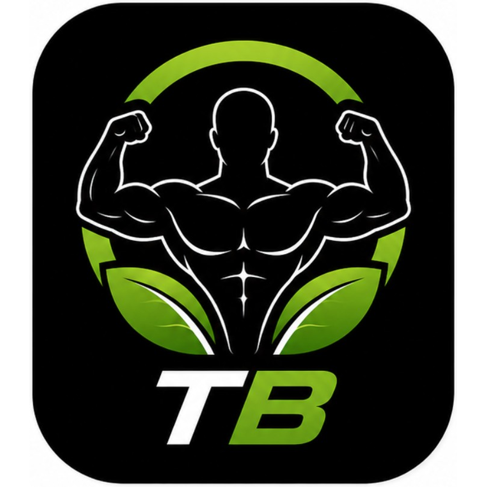

# TO Best — Flutter App

<p align="center">
  
</p>

> **تطبيق Flutter احترافي لإدارة التدريب والتغذية**  
> Professional training & nutrition management system

---

## Tech Stack

| Layer | Technology |
|-------|-----------|
| UI    | Flutter 3.22+ |
| State | Riverpod 2.x |
| Nav   | GoRouter |
| API   | Google Apps Script (Web App) |
| Cache | SQLite (sqflite) |
| Auth  | FlutterSecureStorage |

## Features

- 🏋️ **Workout** — برامج UL/AP/FB/ARNOLD/PPL مع تسجيل مفصّل + PR detection
- 🥗 **Nutrition** — تتبع الماكروز والماء يومياً
- 📅 **Attendance** — تقويم شهري تفاعلي
- 📊 **Progress** — قياسات الجسم + رسوم بيانية
- 💬 **Chat** — دردشة متعددة الغرف (عام/إعلانات/دعم)
- 🛡️ **Admin Panel** — إدارة المستخدمين والاشتراكات والأكواد
- 🔄 **Auto Sync** — مزامنة تلقائية مع retry عند انقطاع الإنترنت
- 🌐 **Bilingual** — عربي (RTL) + إنجليزي (LTR)
- 🎨 **Theme** — داكن / فاتح + 8 ألوان accent
- ⬆️ **Update System** — تحديث اختياري / إجباري

## Quick Start

```bash
flutter pub get
flutter gen-l10n
flutter run
```

## Build

```bash
# APK
flutter build apk --release

# AAB (Google Play)
flutter build appbundle --release
```

## Docs

| الملف | المحتوى |
|-------|---------|
| [docs/01_PROJECT_DOCS.md](docs/01_PROJECT_DOCS.md) | وثائق شاملة للمشروع |
| [docs/02_DEPLOYMENT.md](docs/02_DEPLOYMENT.md) | النشر والتوزيع |
| [docs/03_QUICKSTART.md](docs/03_QUICKSTART.md) | Quick start للمطور |

## Structure

```
lib/
├── core/          # ثوابت، ألوان، theme، utils
├── features/      # كل ميزة مستقلة
├── services/      # API، Cache، Sync
└── widgets/       # مكونات مشتركة
```

---

**Version:** 8.2.0 | **Flutter:** 3.22+ | **Min SDK:** Android 6.0 (API 23)
